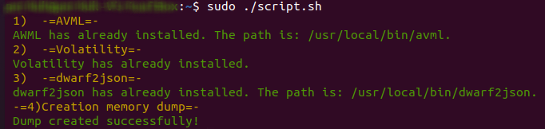
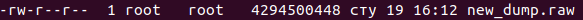

# VolatilitySetup  

Данный скрипт, написанный на Bash, предназначен для установки AWML, Volatility, dwarf2json, а также для создания дампа оперативной памяти. В ходе установки каждый пакет проверяется на наличие, в процессе установки о выявленных ошибках выводится сообщение, в проивном случае пользователю выводится информация об окончании установки.   
  
```
#!/bin/bash

G='\033[32m'
R='\033[31m'
B='\033[34m'
Y='\033[33m'
RES='\033[0m'

sudo apt update && sudo apt upgrade -y

# Installing AVML
echo -e "$Y 1)  -=AVML=- $RES"
if command -v avml &> /dev/null; then
        echo -e "$G AWML has already installed. The path is: $(command -v avml). $RES "
else
        echo -e "$Y Installing AWML... $RES "
        wget https://github.com/microsoft/avml/releases/download/v0.2.0/avml -O avml
        if [ $? -ne 0 ]; then
                echo -e "$R ERROR! $RES"
                exit 1
        else
                chmod +x avml
                sudo mv avml /usr/local/bin/
                echo -e "$G AWML installed successfully! $RES"
        fi
fi

# Installing Volatility
echo -e "$Y 2)  -=Volatility=- $RES"
if pip3 show volatility3 &> /dev/null; then
        echo -e "$G Volatility has already installed. $RES "
else
        echo -e "$Y Installing Volatility... $RES "
        sudo apt install -y python3-pip
        sudo pip3 install volatility3
        if [ $? -ne 0 ]; then
                echo -e "$R ERROR! $RES"
                exit 1
        else
                echo -e "$G Volatility installed successfully! $RES"
        fi
fi

# Installing dwarf2json
echo -e "$Y 3)  -=dwarf2json=- $RES"
if command -v dwarf2json &> /dev/null; then
        echo -e "$G dwarf2json has already installed. The path is: $(command -v dwarf2json). $RES "
else
        echo -e "$Y Installing dwarf2json... $RES "
        echo -e "$B Warning! For installing dwarf2json Golang-go is begin to install. $RES"
        sudo snap install go --classic
        if [ $? -ne 0 ]; then
                echo -e "$R ERROR! $RES"
                exit 1
        else
                echo -e "$G Golang-go installed successfully! $RES"
                git clone https://github.com/volatilityfoundation/dwarf2json.git
                if [ $? -ne 0 ]; then
                        echo -e "$R ERROR! $RES"
                        exit 1
                else
                        cd dwarf2json
                        go build
                        sudo mv dwarf2json /usr/local/bin/
                        cd ..
                        echo -e "$G dwarf2json installed successfully! $RES"
                fi
        fi
fi

# Creation operating memory dump
echo -e "$Y 4) -=Creation memory dump=- $RES"
sudo avml new_dump.raw
echo -e "$G Dump created successfully! $RES"

```

Далее необходимо дать разрешение скрипту на исполнение и выполняем его:
```
sudo chmod +x script.sh
sudo ./script.sh
```
Результат приведен ниже (у меня были установлены данные программы ранее, поэтому скрипт выдал сообщение о том, что данные программы установлены, и создал дамп памяти "new_dump.raw"):
  
  


